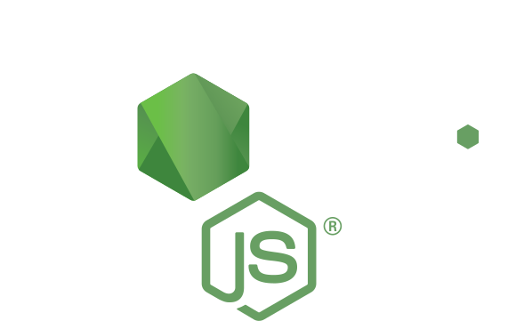

## Hi there 👋 My name is Rama Badash

### I am A full-stack-developer

<!--
**ramabadash/ramabadash** is a ✨ _special_ ✨ repository because its `README.md` (this file) appears on your GitHub profile.

Here are some ideas to get you started:

- 👯 I’m looking to collaborate on ...
- 🤔 I’m looking for help with ...
- 💬 Ask me about ...
- 😄 Pronouns: ...
-->

- **🏢 I am currently looking for a Junior full-stack developer position.**
- **📹 I’m currently working on "Zoomish" - Zoom-clone project.**
- **🌱 I’m currently learning Python.**
- **📫 Connect with me on LinkedIn - [Rama Badash](https://www.linkedin.com/in/rama-badash/).**
- **🚑 Fun fact: I am a Paramedic and I am volunteering in "Magen David Adom" (The Israeli Rescue Organization).**

---

## My technological toolbox 🧰

> Tools, languages, and other things that I like to work with.

<table>
  <tr>
    <td align="center" width="96">
      
       HTML
    </td>
    <td align="center" width="96">
      
       CSS
    </td>
    <td align="center" width="96">
      
       TypeScript
    </td>
    <td align="center" width="96">
      
       JavaScript
    </td>
    <td align="center" width="96">
      
       React
    </td>
    <td align="center" width="96">
      
       Redux
    </td>
    <td align="center" width="96">
      
       Bootstrap
    </td>
    <td align="center" width="96">
      
       Puppeteer
    </td>
  </tr>
  <tr>
    <td align="center" width="96"> 
      
       NodeJS
    </td>
    <td align="center" width="96"> 
      
       Docker
    </td>
    <td align="center" width="96">
      
       Powershell
    </td>
    <td align="center"  width="96">
      
       MySQL
    </td>
    <td align="center"  width="96">
      
       MongoDB
    </td>
    <td align="center"  width="96">
      
       AWS
    </td>
    <td align="center"  width="96">
      
       Cypress
    </td>
    <td align="center"  width="96">
      
       Jest
    </td>
  </tr>
</table>

## Still learning 🏫

> Tools, languages, and other things that I currently learning.

<table>
  <tr>
    <td align="center" width="96">
      
       Python
    </td>
    <td align="center" width="96">
      
       Go
    </td>
    <td align="center" width="96">
      
       Sass
    <td align="center" width="96">
      
       Kubernetes
    </td>
    </td>
</table>
